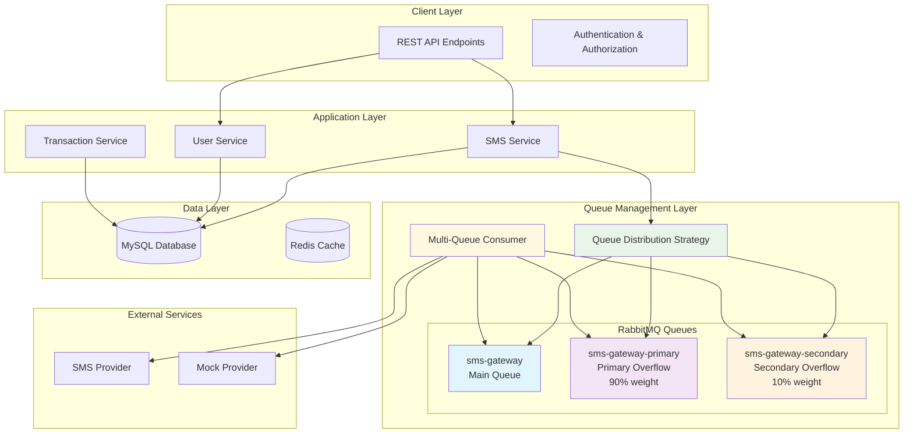
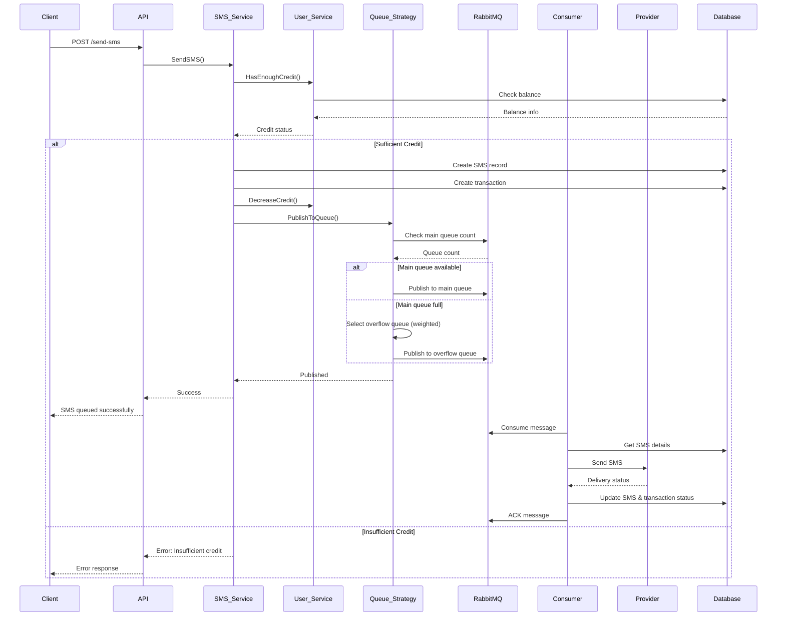
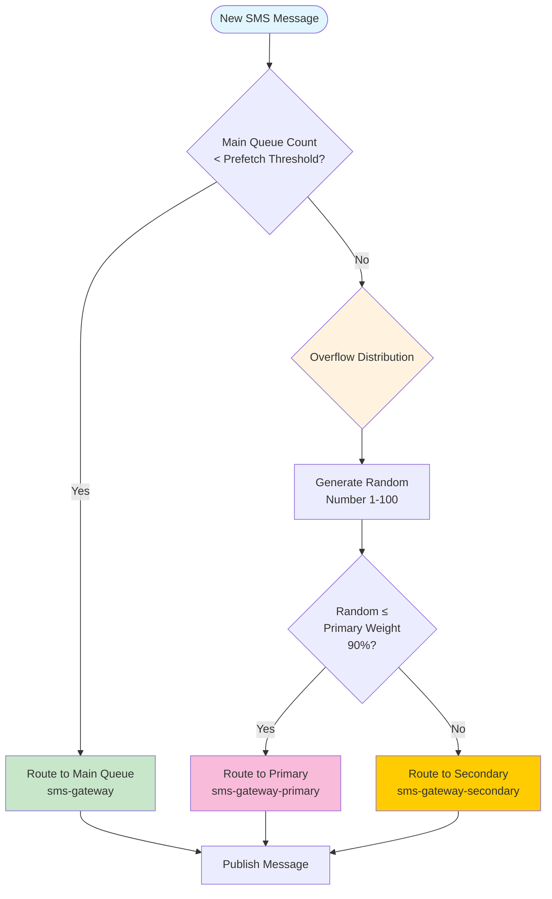
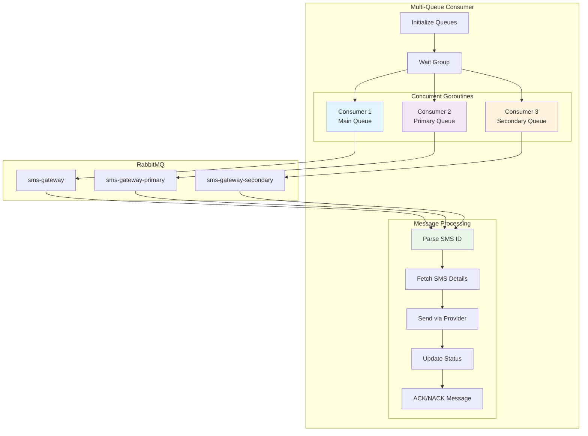

# 📱 SMS Gateway - Intelligent Queue Management System

## 🏗️ System Architecture

### High-Level Architecture

### SMS Processing Flow

## 🧠 Intelligent Queue Distribution Strategy

### Queue Selection Algorithm

### Key Features

- **🎯 Adaptive Load Balancing**: Automatically switches to overflow queues when main queue reaches capacity
- **⚖️ Weighted Distribution**: 90% to primary overflow, 10% to secondary overflow
- **📊 Real-time Monitoring**: Continuously monitors queue depths
- **🔄 Graceful Degradation**: Maintains service availability under high load

## 🔄 Multi-Queue Consumer Architecture

Our multi-queue consumer pattern ensures efficient processing across all queues:

### Concurrent Consumer Pattern

### Queue Configuration Details

| Queue Name | Purpose | Weight | Use Case |
|------------|---------|---------|----------|
| `sms-gateway` | Main queue | N/A | Primary message processing under normal load |
| `sms-gateway-primary` | Primary overflow | 90% | High-priority overflow traffic |
| `sms-gateway-secondary` | Secondary overflow | 10% | Additional capacity for peak loads |

